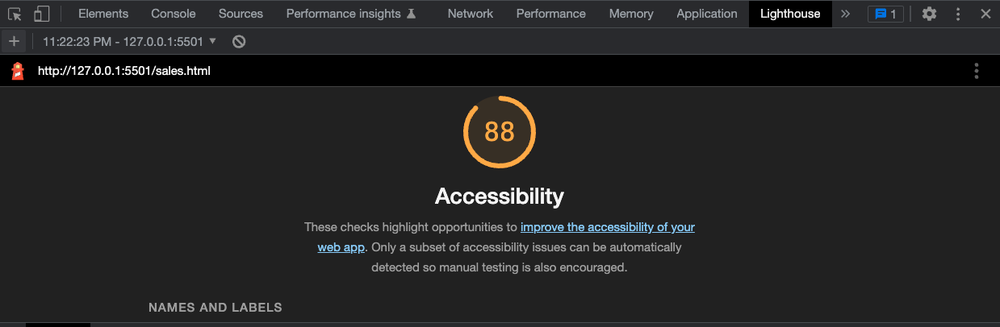

# LAB - 06

## cookie-stand

I built a data model to calculate the average of cookies purchased per customer.

#### Author: Malik Sadiki-Torres

### Links and Resources

* [Random Number Generator](https://developer.mozilla.org/en-US/docs/Web/JavaScript/Reference/Global_Objects/Math/random)

